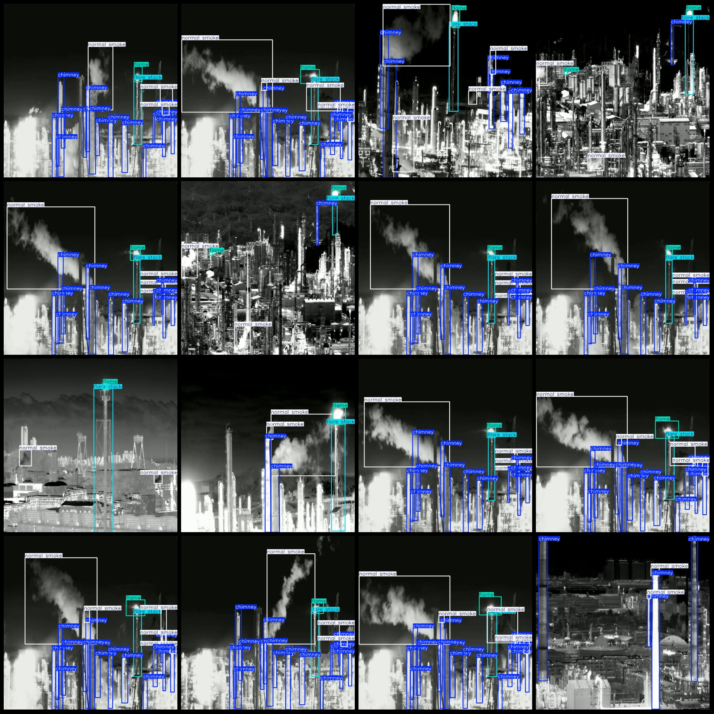
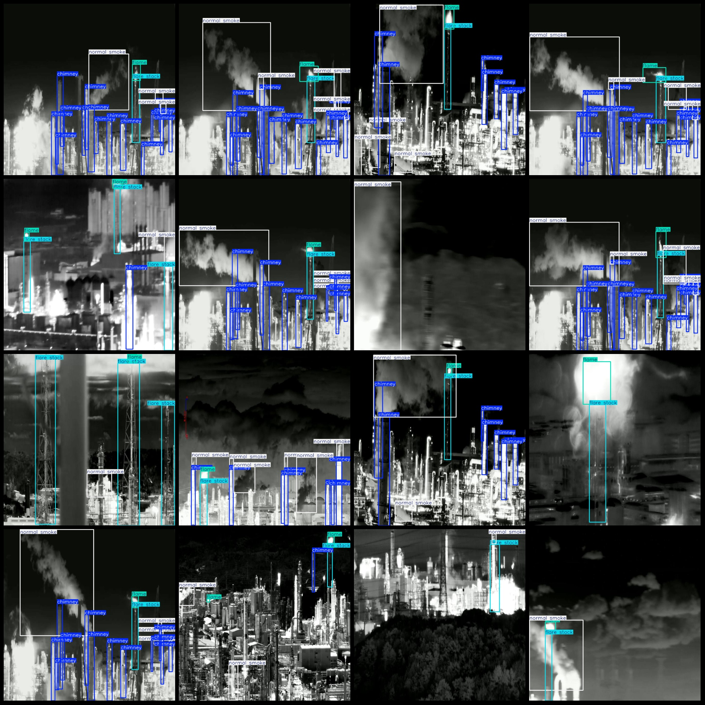

# Industrial Petrochemical Factory Smokestack Emission Detection Dataset - VOC+YOLO Format
4,137 images in VOC+YOLO format: 4 categories

Note: Approximately half of the dataset contains enhanced images, while the other half is original.
Dataset format: Pascal VOC format + YOLO format (excluding split path txt files, only including JPG images and corresponding VOC XML files and YOLO txt files)
Number of images (JPG file count): 4,137
Number of annotations (XML file count): 4,137
Number of annotations (txt file count): 4,137
Number of annotation categories: 4
Annotation category names (notice that the order in YOLO format may not match this, but refer to the labels folder's classes.txt for consistency): ["chimney", "flame", "flare stack", "normal smoke"]
Box counts for each category:
- Chimney (smokestack) = 27,014
- Flame (fire) = 3,970
- Flare stack (torch stack/torch tower) = 3,997
- Normal smoke (normal smoke) = 10,126
Total box count = 45,107
Number of images per category:
- Chimney (smokestack) = 3,408
- Flame (fire) = 3,349
- Flare stack (torch stack/torch tower) = 3,423
- Normal smoke (normal smoke) = 3,423
Image resolution: 704x704
Annotation tool used: labelImg
Annotation rules: draw a rectangle around the category
Important note: The dataset does not include training validation test sets; you must partition them yourself.
Special declaration: This dataset does not guarantee any accuracy of the trained models or weight files.
Image preview:
Annotation example:

## Images

Here is a pay link on Stripe ( https://buy.stripe.com/3cs8yP7sY87d0vu9AB ). Please contact me lonlonago@foxmail.com after funding $89, and I will send you a complete data files , thank you!

